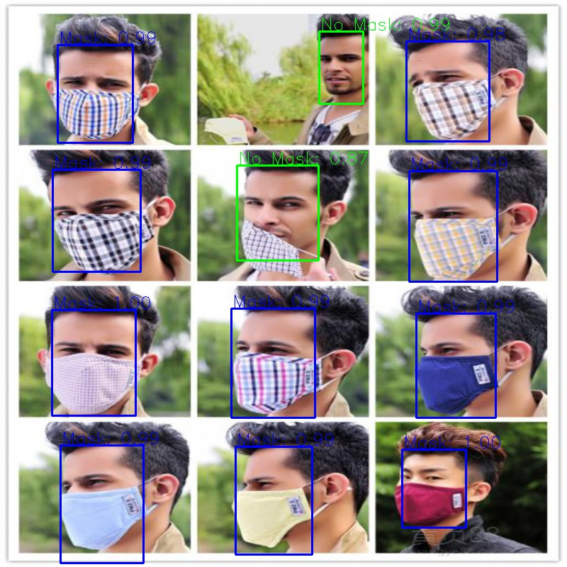

# Face-Mask-Detection
## Haolin Zhang

人脸口罩检测（中文）/ Face mask detection (English)  
<!--[杭州深想科技](http://www.deeptk.com/)（中文）/ Hangzhou Shenxiang Technology (English)!-->  
Update 2021/01/01: Faster R-CNN based Face Mask Detector  
  
<p align="center">

</p>

## Environment

We recommend to use `anaconda` to create a python3 environment to manage the pytorch-GPU environment.   
You can use the following commands to configure your environment:
```shell
conda create -n {your environment name} python=3.7
```
Then `anaconda` will solve the dependencies automatically for you. (Make sure you have successfully installed the NVIDIA driver.)

Then you need to install following dependencies in your conda environment:  
```
pytorch-GPU or pytorch > 1.0  
python-opencv > 3.0  
torchvision
numpy
```

## Getting Started
1. Download the AIZOO Face Mask Detection Dataset (or you can use your own dataset, make sure in same format)
([link](https://github.com/AIZOOTech/FaceMaskDetection)) 
and copy the dataset `AIZOO` into the root folder as `/Face-Mask-Detection/AIZOO`.
The files in `AIZOO` are as follow:
   ```shell script
   /AIZOO/
    ├── train
    ├── val
    └── readme.md
    ```   

2.Process the Dataset by running 'dataset_copy.py'. In our demo, we use 800 images for training and 500 images for validation.  
Then processed `train` folder and `val` folder will show in the root folder as follow:    
   
```shell script  
   /ROOT/  
    ├── train  
    │   ├── Annotations  
    │   ├── JPEGImages  
    │   └── train.txt  
    └── val  
        ├── Annotations  
        ├── JPEGImages  
        └── val.txt  
```

    note: you can choose how many images you want to use for training and validation by revising 'dataset_copy.py'.  
    
3. Traing the Faster R-CNN based Face Mask Detection Model. Run `train_faster_rcnn.py` (you can set customized parameters)  


## Evaluation and Demo  

1. After the trained models are saved in `checkpoints_faster_rcnn`, you can run `evaluation_faster_rcnn` to calculate mAP for both Face With mask and Face Without Mask.
2. After the trained models are saved in `checkpoints_faster_rcnn`, you can run `demo_faster_rcnn.py` to visualize the detection result by changing `demo.jpg`.   

## Experimental Results

epoches = 10, Adam Optimizer, learning rate = 0.0001  
800 images (400: with mask 400: without mask) for training  
500 images (250: with mask 250: without mask) for testing  

Face Without Mask  
|  IoU threshold   | 0.5  | 0.7   | 0.9  |
|  ----  | ----  | ----  | ----  |
| mAP  | 0.83 | 0.69  | 0.10 |

Face With Mask  
|  IoU threshold   | 0.5  | 0.7   | 0.9  |
|  ----  | ----  | ----  | ----  |
| mAP  | 0.90 | 0.80  | 0.01 |


## Reference
https://github.com/AIZOOTech/FaceMaskDetection  
https://github.com/aky15/AIZOO_torch  
Ren, Shaoqing, Kaiming He, Ross Girshick, and Jian Sun. "Faster r-cnn: Towards real-time object detection with region proposal networks." IEEE transactions on pattern analysis and machine intelligence 39, no. 6 (2016): 1137-1149. 
Chowdary, G. Jignesh, Narinder Singh Punn, Sanjay Kumar Sonbhadra, and Sonali Agarwal. "Face Mask Detection using Transfer Learning of InceptionV3." arXiv preprint arXiv:2009.08369 (2020).
Jiang, Mingjie, and Xinqi Fan. "RetinaMask: A Face Mask detector." arXiv preprint arXiv:2005.03950 (2020).

